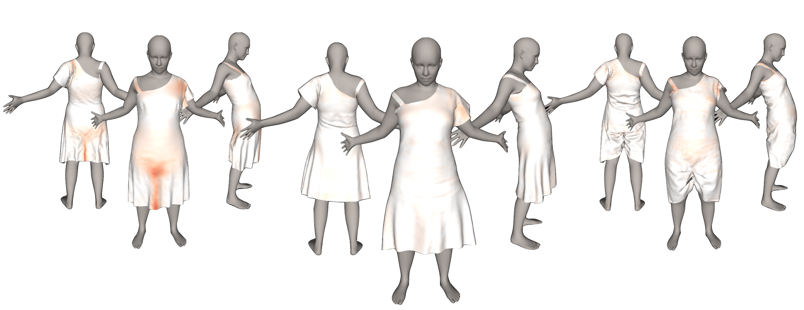

# SNUG: Self-Supervised Neural Dynamic Garments



## Abstract

> Recent neural, physics-based modeling of garment deformations allows faster and visually aesthetic results as opposed to the existing methods. Material-specific parameters are used by the formulation to control the garment inextensibility. This delivers unrealistic results with physically implausible stretching. Oftentimes, the draped garment is pushed inside the body which is either corrected by an expensive post-processing, thus adding to further inconsistent stretching; or by deploying a separate training regime for each body type, restricting its scalability. Additionally, the flawed skinning process deployed by existing methods produces incorrect results on loose garments.  
In this paper, we introduce a geometrical constraint to the existing formulation that is collision-aware and imposes garment inextensibility wherever possible. Thus, we obtain realistic results where draped clothes stretch only while covering bigger body regions. Furthermore, we propose a geometry-aware garment skinning method by defining a body-garment closeness measure which works for all garment types, especially the loose ones.
# Running the Code

**Requirements**: ```python3.8```, ```tensorflow-2.10```, ```numpy-1.23.0```, ```scipy-1.10.1```

Create conda virtual environment (Recommended):
```
conda create -n gaps python=3.8
conda activate gaps
python -m pip install -r requirements.txt
```

## Download human model

1. Sign in into https://smpl.is.tue.mpg.de
2. Download SMPL version 1.0.0 for Python 2.7 (10 shape PCs)
3. Extract ```SMPL_python_v.1.0.0.zip``` and copy ```smpl/models/basicModel_f_lbs_10_207_0_v1.0.0.pkl``` in ```assets/SMPL```

## Download animation sequences

We use sequences from AMASS to test our model. To download the sequences follow these steps:
1. Sign in into https://amass.is.tue.mpg.de
2. Download the body data for the CMU motions (SMPL+H G)
3. Extract ```CMU.tar.bz2``` in ```assets/CMU```:  


## Train
```sh
python -u train_gaps.py --config config/train.ini
```

## Predict
To generate garment meshes given a motion sequence, change the settings in file eval.ini and run:
```sh
python run_sequences.py
```


## Configuration files
```train.ini``` and ```eval.ini``` contains training and prediction configuration, respectively.
